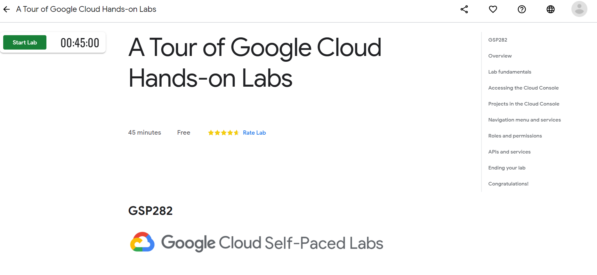
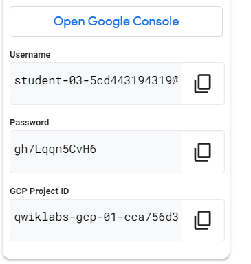
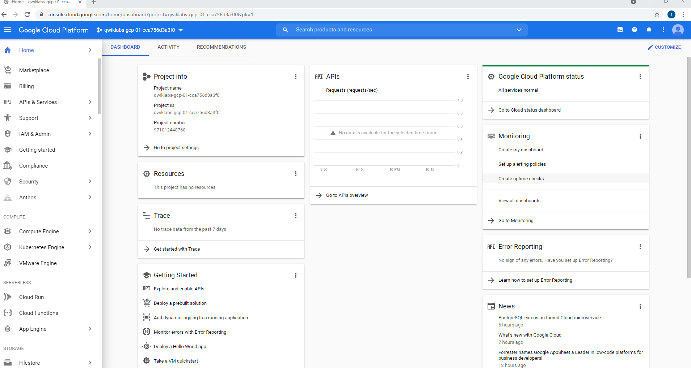
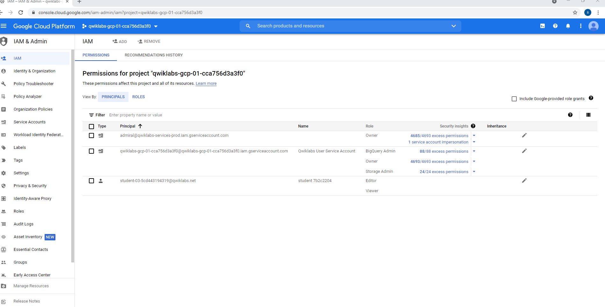
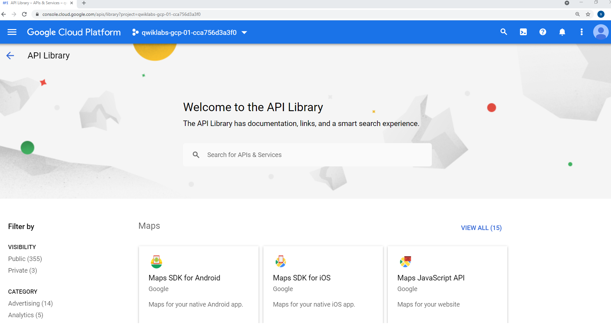
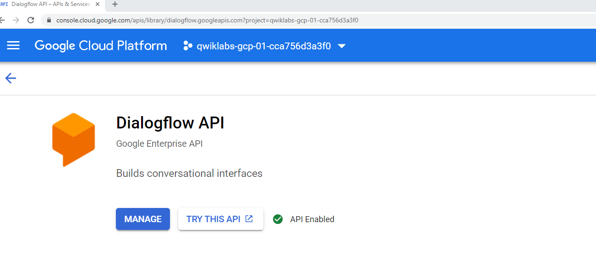
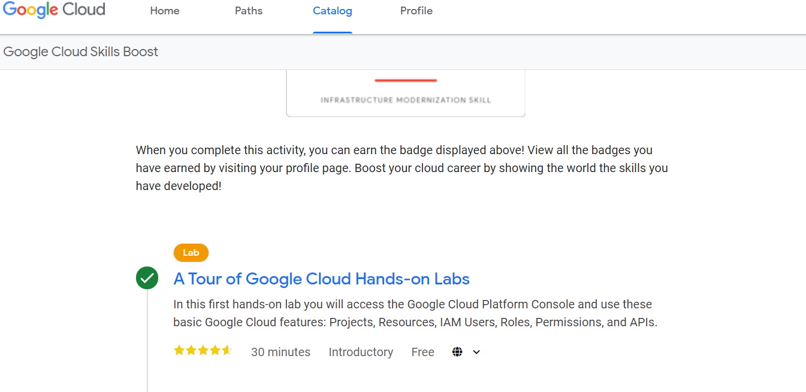

# Lab 10  A Tour of Google Cloud Hands-on Labs

Click `Start Lab`

Task 1: Sign in to Google Cloud

Logged in with credentials below

     
Read and Answered Questions

Task 2: View all projects

Read and Answered Questions
     
Task 3: View your roles and permissions

Read and Answered Questions

Task 4: View available APIs

     

     

