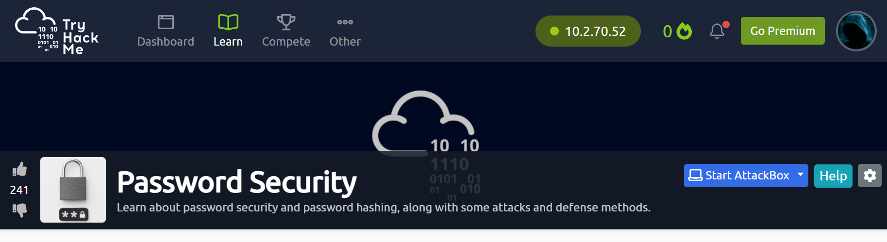

# TryHackMe Lab 7 Metasploit

     
#Password Security

#Task 1  Credits
This room material is largely based on slides made by Dr. Ruben Niederhagen and Dr. Andreas Hülsing from
the Technical University of Eindhoven. Explicit permission was obtained before making this room. I would
like to thank them both for allowing us to make use of their work!

Good luck and have fun completing this room! If you were to find any problems (e.g. inaccuracies, typos) 
in it, feel free to reach out on the Discord server. My username is Abd  on there.

`Completed`

#Task 2  Introduction
Passwords are one of the three forms of authentication, namely, what you know (along with what you have
and what you are). Passwords are used almost everywhere as the first line of defense against unauthorized
access to certain resources. Password-based authentication was first used in 1961 at MIT [source].

In this room, we explain what password hashing is, types of attacks carried out against passwords, defense
methods, and some advice on how to mitigate the risks of password leaks.

Let us first define what password hashing is and some of the common hashing algorithms used. We will go 
into further depth in Task 6 but it is important to understand the basics first.

When a password is hashed, a one-way hashing algorithm function is performed on a password that generates 
a fingerprint or representation of the provided password, which we then identify as the hash. One-way
hashing functions are generally easy to compute. However, the computation required to obtain the original
input (plaintext password in this case) could be difficult and time-consuming, depending on the algorithm.

We can make the distinction between two types of attacks against passwords, namely online and offline attacks.

Online vs offline attacks:

In an online attack, password guessing can be largely defended against using some form of timeout between each 
entry or even some more extreme measure, by denying access to the account after an x number of attempts.
In an offline setting, however, password guessing is much more accessible due to the dedicated hardware and
advanced methods. This could be used by attackers that have obtained a database dump of usernames and passwords.
Since the attack is carried out offline and without any intervention from the victim(s), this type of attack is 
almost impossible to defend against. However, this attack could be mitigated.
In the next sections, we'll explore different methods of password cracking attackers could deploy and statistics
involving passwords.

When was the first password introduced?

Answer-`1961`

The result of a hash function is a string in which we clearly can see the original password. yay/nay

Answer-`nay`

a hash function is a _____ function.

Answer-`one-way`

What form of authentication is password-based authentication?

Answer-`what you know`

For which setting is a password guessing attack more dangerous, online or offline?

Answer-`offline`

#Task 3  Importance of Good Passwords
Password breaches happen way too often, some examples are:

Which social media company suffered a breach of 42,000,000 passwords in the year 2020?

Answer-`TikTok`

Do people re-use their passwords? Yay/nay

Answer-`yay`

A function f(x) = 4x requires _____ the amount of work to go from 4x to 4x+1

Answer-`quadruple`

How many words are there in the Dutch dictionary? (a comma is not needed in the answer)

Answer-`400000`

Consider random passwords chosen from a character set that consists of

- lower & upper case letters,

- numbers, and

- the two special characters "?", and "!".

How many characters must such a password at least have such that brute-force guessing attacks takes >
280 guesses in expectation? I.e. what number, when multiplied by the number of element in the character set
, yields an answer that is bigger than  280

Answer-`14`

A hash function is basically an encryption function? yay/nay

Answer-`nay`

In which year was the hashing function MD5 officially deprecated and by whom? format is year-name

2011-NIST

You learned that a website that you use simply stores passwords in plaintext. Are they adhering to good security practices in that case? yay/nay

Answer-`nay`

The password 'ababababababab' is an example of a password that is chosen uniformly at random. yay/nay

Answer-`nay`

#Task 4  Password Attacks
No matter how complex a password is, how robust a hashing algorithm is, with unlimited (or at least sufficient) 
computing power or storage any password is breakable.
An attacker would most likely prefer to steal a password in transit form for unencrypted login pages, through keylogging,
via phishing, etc. However, if that is not possible, the attacker could still get their hands on passwords using some of

the various methods below.

Guessing :
Unlike software that is dedicated to producing pseudo-random passwords, human-generated passwords tend to not be all that 
random. Most often, passwords are related to the interests of a person, relatives, pets, dates, etc. All this information
makes it easier for an attacker to gain the password without having to use any sophisticated attack. For instance, just by
trying potential combinations such as name + birth date could produce results.

Dictionary attack :
This attack uses a simple file that could contain words, names, numbers, special characters, combinations or/and passwords
from a past breach. One of the wordlists you are probably familiar with is the Rockyou wordlist. It is provided by Kali
Linux in its standard installation and contains 14,341,564 unique passwords. Rockyou (The company) stored these password 
in plaintext for the attacker to see, download, and share :-)

Rainbow tables:
Rainbow table attacks are a variant of dictionary attacks, in which pre-computed dictionaries are used to trade storage
space for decreased time.  This method is particularly effective when an attacker tries to crack a large number of passwords.
Although the pre-computation takes a considerable amount of time to generate the dictionary, the time to carry out the attack
is faster as the generation is done before the attack is carried out.

Brute-force attack :
Unlike Dictionary attacks that use a predefined list of passwords, a brute-force attack extensively works through all possible 
combinations of letters a-zA-Z, number 0-9 and special characters that could make up a password. Depending on the password length,
a brute-force attack may take a considerable amount of time or is just too impractical to carry out.

Luckily there are security measures that could be implemented that essentially try to make breaking passwords unfeasible for an
attacker. Using passwords that are hard to guess and salting them while using strong hash functions are amongst the best precautions
we could take as defenders.

When trying all possible combinations of letters, numbers and special characters, what kind of attack are we performing?

Answer-`Brute-force`

John Doe is the CEO of O-Corp which was established in 1992. Guess John's work email password.

Answer-`John1992`

What are Rainbow tables particularly effective against?

Answer-`large number of passwords`

#Task 5  Password Storage and Defense Mechanisms
There are multiple ways to make the attackers' life harder or simply stall them to give your users as much time as possible
to change their passwords, even if they obtain a database dump of the user's table. The following list is by no means complete,
so if you want to learn about more possible defense mechanisms, I recommend you do some more research.

Storing passwords in plain text: The account database simply contains the login name and plaintext password of the users. This 
is the worst-case scenario! A password breach could be misused immediately by an attacker. Password reuse for other services is
imminent and unfortunately is still a widespread issue!
Storing hashed passwords: Store the username and the derived key (hashed password) in a database: DK = hashFunction(Password).
While this is better than storing passwords in plain text, it still has a lot of weaknesses. As the same password hashes to the
same derived key. An attacker can pre-compute or download a large password/hash table and use it to look up passwords easily! 
For example, a password made from English words is 218 * 8Bytes ~ (~ means approximately) 2MB file. In other words, if an attacker
were to compute a list of password hashes of each word in the English dictionary, this would result in a 2MB file and they just 
need to look up whether a certain password hash is in their list. 8 characters from [a-z] is 268 = 238 * 8Bytes ~ 2.2 terabyte 
of pre-computation storage is needed for near-instant lookup. 10 characters [a-zA-Z] is 5210 = 257 * 8Bytes ~ 1.6 exabyte ( 1exabyte
is equal to 1 million terabytes) of pre-computation storage is needed.
It's important to not misinterpret the example above. This doesn't mean that that much storage is required to carry out such a big 
attack! This simply means, if an attacker wants to do a table lookup and not go through the hassle of brute-forcing 257 combinations,
they would need this much storage. So at one end of the spectrum, you have using 0 storage and brute-forcing 257 possibilities and on
the other end, you have using 1.6EB and having an almost instant lookup of the password. This means that an attacker can, for instance,
have 0.8 EB (half of the 1.6EB) in storage and then do half of the brute-forcing work (half of 257). This is known as a time-space tradeoff.
You could save time by using a lot of storage or you could save a lot of storage by brute-forcing.

Salt: Storing hashed passwords with salt increase the size of the possible passwords.. For each user, an individual random salt is generated 
and stored (plainly) along with the login name and password hash.
Compute password hash as:
DK = hash(Salt || Password) or hash(Password || Salt ) (where || means concatenation)
If the salt is long enough, the attacker can’t use pre-computed tables anymore. This certainly doesn't solve all the problems, but it slows
down an (offline) attack significantly.
Make use of specialized hashing algorithms to slow down the brute-forcing process. More on this in the following task.

Answer-`yay`

Hashing a password (with no salt) ensures that the same password results in different hash values for different users. yay/nay

Answer-`nay`

A password that is made of 8 characters from [a-zA-Z] needs ____ of storage to crack almost instantly. (format is: wholeNumber
xbyte i.e. 7 petabytes) (Hint: type numberOfCharactersInSet^numberOfCharacters * 8bytes on google and round the answer to the 
nearest number) (treat 1 Kilobyte as 1000 bytes)

Answer-`428 terabytes`

When using the time-space trade-offs in attacks against password hashing, the overall complexity (storage + speed) of the attack is the

Answer-`same`

A salt can either be prepended or _______ to the password.

Answer-`appended`

Using a longer value for the salt is better than a short one. yay/nay

Answer-`yay`

What types of hashing algorithms could be used to slow down brute-forcing attacks?

Answer-`specialized hashing algorithms`

#Task 6  Different Hashes Have Different Cracking Speeds
Do you remember how I mentioned in task 3 that a cracking cluster that cracks 237 (180 billion) MD5 hashes per second exists? Well, 
the same machine cracks 235 (63 billion) SHA-1 hashes per second.

How come the same machine cracks different hashing algorithms at different speeds you're asking? This boils down to how easy it is 
to find collisions in the hash function. A collision is when two different values (i.e. passwords) result in the same hash. In some
hashing algorithms, it is easier to find collisions than in others.

This begs the question, can we not design hashing algorithms that are slow to crack? Of course, we can! In fact, in this task we 
introduce some of them.

The idea is to make use of a so-called key derivation function. A key derivation function is simply a method to generate (typically
longer) secrets from a given secret. In this setting, we would be generating strong passwords using the user's not-so-strong password. 
There are many forms of key derivation functions.

Key separation: This is a way to derive multiple independent passwords from a master password.
Key stretching: This function essentially allows you to create a longer password using a short one, effectively, increasing the 
length of the password.
Key whitening: Some algorithms (such as block ciphers) require the key to consist of some fixed amount of random bits. A key that
is not in the desired format could still be transformed using a key whitening function.
Next, we introduce some algorithms that perform key stretching.

=================================================================================

Password-Based Key Derivation Function 2 (PBKDF2): In this case, the password is stored as follows: DK = PBKDF2(PRF, Password, 
Salt, c, dkLen) where PRF is a pseudorandom function (i.e. the hash function, such as HMAC) with output length hLen. Password is 
the master password. Salt is a sequence of bits, known as a cryptographic salt. c is the number of iterations desired (cost). 
dkLen is the desired length of the derived key. DK is the generated derived key. For example, WPA2 uses: DK = PBKDF2(HMAC−SHA1, 
password, ssid, 4096, 256).
Pros of PBKDF2:

The number of iterations could be adjusted which makes brute-forcing more difficult.

Cons of PBKDF2:

It uses a cryptographic hash function designed for speed, which is a con when you want to use this algorithm to slow attackers down.

It does not require much memory from the attacker.

It offers low protection against GPU/FPGA/ASIC based crackers.

=================================================================================

bcrypt: DK = bcrypt(Cost, Salt, Password) where Cost is a parameter to control the time cost. Salt is a sequence of bits, known as a
cryptographic salt. Password  is the master password. DK is the generated derived key. Bcrypt uses Blowfish encryption with a
modified key setup function that was designed by Bruce Schneier (remember this name for later on). Blowfish is a symmetric-key
block cipher that has a relatively large cost when it comes to changing keys. Each new key requires a relatively large pre-processing 
step, which makes Blowfish slow when it comes to changing keys. This is exactly why it is used in bcrypt.
Pros of bcrypt:

Has a cost factor to adapt to changes in computing power.
It uses an expensive function based on Blowfish encryption.

Cons of bcrypt:

It does not require much memory from the attacker.

It offers medium protection against GPU/FPGA/ASIC based crackers

=================================================================================

scrypt: can be seen as an updated version of bcrypt. DK = scrypt(Password,Salt,N,p,dkLen) where dkLen is the intended output length
of the derived key. N is the CPU/memory cost parameter.  p is the parallelization parameter (that multiplies the amount of work to be
done so that the additional workloads are independent of each other and can be performed in parallel).
Pros of scrypt:

Has a cost factor for both time and memory.
It uses PBKDF2 as a building block.

Cons of scrypt:

The cost for both time and memory-bound to one parameter.
“Too new” compared to bcrypt; crypto ripens with age.

=================================================================================

Argon2: Similar to bcrypt and scrypt, Argon2 also has a dkLen parameter. But it is different in the sense that it has different 
parameters for the CPU cost and memory cost. t is the CPU cost parameter and m is the memory cost parameter. It also has a 
parallelization parameter named p.
Pros of Argon2:

The cost for memory and time can be controlled separately.
Two versions, one with higher cost (cryptocurrencies), one secure against timing attacks (password hashing).

Argon2 was the winner of the Password Hashing Competition (PHC).

Cons of Argon2:

Even newer than scrypt!
=================================================================================

Critique of such hashing functions

You might be thinking: great news, we have those fancy hashing algorithms, so why isn't every company using them?

This boils down to two reasons. Firstly, most companies do not change their hashing methods without a reason.

Secondly, while these hashing functions certainly offer great higher cost to the attacker to carry out their attack, compared
to a more traditional like SHA-256, they also come at a cost for the platform. The mathematical operations required to compute
the hash is also somewhat costly for the
server. In other words, they require extensive computation to process a login event.

Does that mean that these shouldn't be used? Absolutely not! If you were to ask me, I believe that every company that stores
users' passwords should use them. The extra computation is worth the extra protection these functions offer. In fact, many
big companies are using these functions already, such as Facebook that uses scrypt.

All hashing algorithms are cracked at the same speed. yay/nay

Answer-`nay`

Which hashing algorithm (of the ones introduced in this section) is the newest?

Answer-`Argon2`

A key separation function is the same as key stretching function. yay/nay

Answer-`nay`

What does the parameter c represent in the aforementioned algorithms?

Answer-`cost`

Crypto _____ with age.

Answer-`ripens`

The hashing functions introduced in this section are widely used by companies. yay/nay

Answer-`nay`

Which hashing algorithm won the Password Hashing Competition?

Answer-`Argon2`

#Task 7  Advice
Bruce Schneier, an American cryptographer that created the Blowfish cipher, suggests the following:

Never reuse a password you care about. Even if you choose a secure password, the site it’s for could leak
it because of its own incompetence.
You don’t want someone who gets your password for one application or site to be able to use it for another.
Don’t bother updating your password regularly. Sites that require 90-day – or whatever – password upgrades 
do more harm than good. Unless you think your password might be compromised, don’t change it.
Beware the “secret question”. You don’t want a backup system for when you forget your password to be easier
to break than your password.
Really, it’s smart to use a password manager. Or to write your passwords down on a piece of paper and secure
that piece of paper.
One more piece of advice: if a site offers two-factor authentication, seriously consider using it. It’s almost
certainly a security improvement.

Advice for administrators/developers (not from Bruce Schneier):

DO NOT STORE PLAINTEXT PASSWORDS!
The extra cost for strong password hashing is justified!

Storing passwords in plaintext is fine. yay/nay

Answer-`nay`

Two-factor authentication is likely to be a security improvement. yay/nay

Answer-`yay`

#Task 8  Conclusion/Disclaimer
Disclaimer: This room is meant to be an introductory level room, which means, it doesn't cover everything related
to passwords. Moreover, I’m not an expert in this field. Do not rely on this room for implementing any kind of 
crypto routine of your own, especially in a production
environment. Instead, use a well-known standard.

