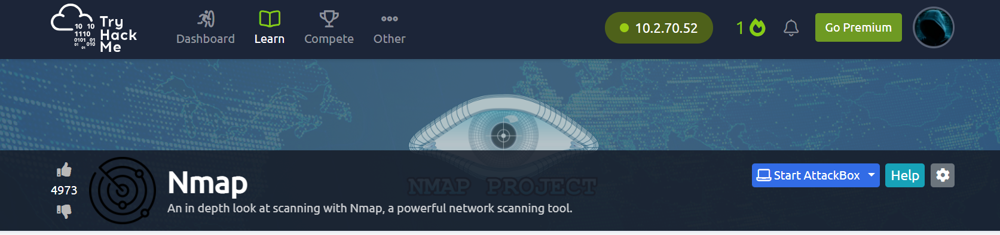
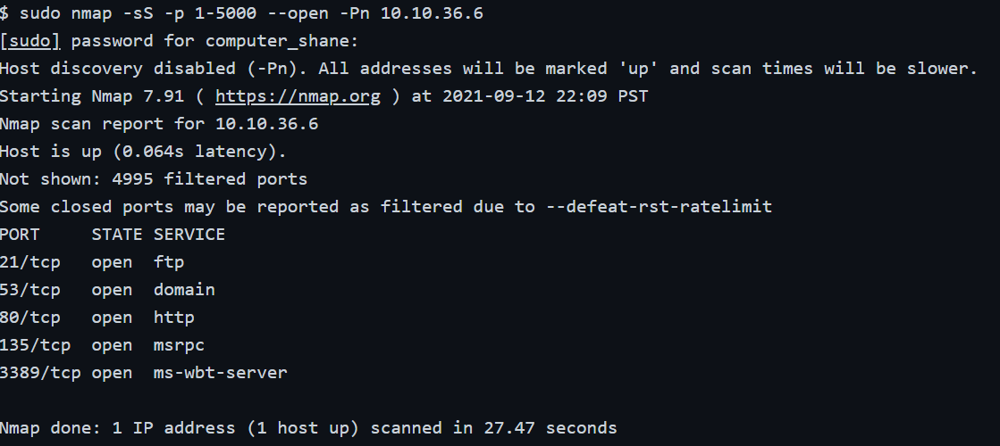

# TryHackMe Lab 3 Nmap

     
# Task 1  Intro Deploy The Machine
Connected VPN   

# Task 2  Introduction

What networking constructs are used to direct traffic to the right application on a server?

Answer-`ports`

How many of these are available on any network-enabled computer?

Answer-`65535`

[Research] How many of these are considered "well-known"? (These are the "standard" numbers mentioned in the task)

Answer-`1024`

# Task 3  Nmap Switches

Like most pentesting tools, nmap is run from the terminal. There are versions available for both Windows and Linux. For this room we will assume that you are using Linux; however, the switches should be identical. Nmap is installed by default in both Kali Linux and the TryHackMe Attack Box.

Nmap can be accessed by typing nmap into the terminal command line, followed by some of the "switches" (command arguments which tell a program to do different things) we will be covering below.

All you'll need for this is the help menu for nmap (accessed with nmap -h) and/or the nmap man page (access with man nmap). For each answer, include all parts of the switch unless otherwise specified. This includes the hyphen at the start (-).

Ran command `nmap -h`

What is the first switch listed in the help menu for a 'Syn Scan' (more on this later!)?

Answer-`-Ss`

Which switch would you use for a "UDP scan"?

Answer-`-su`

If you wanted to detect which operating system the target is running on, which switch would you use?

Answer-`-o`

Nmap provides a switch to detect the version of the services running on the target. What is this switch?

Answer-`-sv`

The default output provided by nmap often does not provide enough information for a pentester. How would you increase the verbosity?

Answer-`-v`

Verbosity level one is good, but verbosity level two is better! How would you set the verbosity level to two?
(Note: it's highly advisable to always use at least this option)

Answer-`-vv`

We should always save the output of our scans -- this means that we only need to run the scan once (reducing network traffic and thus chance of detection), and gives us a reference to use when writing reports for clients.

What switch would you use to save the nmap results in three major formats?

Answer-`-oA`

What switch would you use to save the nmap results in a "normal" format?

Answer-`-oN`

A very useful output format: how would you save results in a "grepable" format?

Sometimes the results we're getting just aren't enough. If we don't care about how loud we are, we can enable "aggressive" mode. This is a shorthand switch that activates service detection, operating system detection, a traceroute and common script scanning.

How would you activate this setting?

Answer-`-oG`

Sometimes the results we're getting just aren't enough. If we don't care about how loud we are, we can enable "aggressive" mode. This is a shorthand switch that activates service detection, operating system detection, a traceroute and common script scanning.

How would you activate this setting?

Answer-`-A`

Nmap offers five levels of "timing" template. These are essentially used to increase the speed your scan runs at. Be careful though: higher speeds are noisier, and can incur errors!

How would you set the timing template to level 5?

Answer-`-T5`

e can also choose which port(s) to scan.

How would you tell nmap to only scan port 80?

Answer-`-p 80`

How would you tell nmap to scan ports 1000-1500?

Answer-`-p 1000-15000`

A very useful option that should not be ignored:

How would you tell nmap to scan all ports?

Answer-`-p-`

How would you activate a script from the nmap scripting library (lots more on this later!)?

Answer-`-script=vuln`

# Task 4  Scan Types Overview

When port scanning with Nmap, there are three basic scan types. These are

TCP Connect Scans (-sT)
SYN "Half-open" Scans (-sS)
UDP Scans (-sU)
Additionally there are several less common port scan types, some of which we will also cover (albeit in less detail). These are:

TCP Null Scans (-sN)
TCP FIN Scans (-sF)
TCP Xmas Scans (-sX)
Most of these (with the exception of UDP scans) are used for very similar purposes, however, the way that they work differs between each scan. This means that, whilst one of the first three scans are likely to be your go-to in most situations, it's worth bearing in mind that other scan types exist.

In terms of network scanning, we will also look briefly at ICMP (or "ping") scanning.

# Task 5  Scan Types TCP Connect Scans

To understand TCP Connect scans (-sT), it's important that you're comfortable with the TCP three-way handshake. If this term is new to you then completing Introductory Networking before continuing would be advisable.
 
Which RFC defines the appropriate behaviour for the TCP protocol?
  
Answer-`RFC 793`
 
If a port is closed, which flag should the server send back to indicate this?

Answer-`RST`

# Task 6  Scan Types SYN Scans

As with TCP scans, SYN scans (-sS) are used to scan the TCP port-range of a target or targets; however, the two scan types work slightly differently. SYN scans are sometimes referred to as "Half-open" scans, or "Stealth" scans.

There are two other names for a SYN scan, what are they?

Answer-`half-open, stealth`

Can Nmap use a SYN scan without Sudo permissions (Y/N)?

Answer-`n`

# Task 7  Scan Types UDP Scans

Unlike TCP, UDP connections are stateless. This means that, rather than initiating a connection with a back-and-forth "handshake", UDP connections rely on sending packets to a target port and essentially hoping that they make it. This makes UDP superb for connections which rely on speed over quality (e.g. video sharing), but the lack of acknowledgement makes UDP significantly more difficult (and much slower) to scan. The switch for an Nmap UDP scan is (-sU)

If a UDP port doesn't respond to an Nmap scan, what will it be marked as?

Answer-`open|filtered`

When a UDP port is closed, by convention the target should send back a "port unreachable" message. Which protocol would it use to do so?

Answer-`ICMP`

# Task 8  Scan Types NULL, FIN and Xmas

NULL, FIN and Xmas TCP port scans are less commonly used than any of the others we've covered already, so we will not go into a huge amount of depth here. All three are interlinked and are used primarily as they tend to be even stealthier, relatively speaking, than a SYN "stealth" scan. Beginning with NULL scans:

Which of the three shown scan types uses the URG flag?

Answer-`xmas`

Why are NULL, FIN and Xmas scans generally used?

Answer-`firewall evasion`

Which common OS may respond to a NULL, FIN or Xmas scan with a RST for every port?

Answer-`Microsoft Windows`

# Task 9  Scan Types ICMP Network Scanning

On first connection to a target network in a black box assignment, our first objective is to obtain a "map" of the network structure -- or, in other words, we want to see which IP addresses contain active hosts, and which do not.

One way to do this is by using Nmap to perform a so called "ping sweep". This is exactly as the name suggests: Nmap sends an ICMP packet to each possible IP address for the specified network. When it receives a response, it marks the IP address that responded as being alive. For reasons we'll see in a later task, this is not always accurate; however, it can provide something of a baseline and thus is worth covering.

How would you perform a ping sweep on the 172.16.x.x network (Netmask: 255.255.0.0) using Nmap? (CIDR notation)

Answer-`nmap -sn 172.16.0.0/16`

# Task 10  NSE Scripts Overview

The Nmap Scripting Engine (NSE) is an incredibly powerful addition to Nmap, extending its functionality quite considerably. NSE Scripts are written in the Lua programming language, and can be used to do a variety of things: from scanning for vulnerabilities, to automating exploits for them. The NSE is particularly useful for reconnaisance, however, it is well worth bearing in mind how extensive the script library is.

There are many categories available. Some useful categories include:

safe:- Won't affect the target
intrusive:- Not safe: likely to affect the target
vuln:- Scan for vulnerabilities
exploit:- Attempt to exploit a vulnerability
auth:- Attempt to bypass authentication for running services (e.g. Log into an FTP server anonymously)
brute:- Attempt to bruteforce credentials for running services
discovery:- Attempt to query running services for further information about the network (e.g. query an SNMP server).

What language are NSE scripts written in?

Answer-`lua`

Which category of scripts would be a very bad idea to run in a production environment?

Answer-`intrusive`

# Task 11  NSE Scripts Working with the NSE

In Task 3 we looked very briefly at the --script switch for activating NSE scripts from the vuln category using --script=vuln. It should come as no surprise that the other categories work in exactly the same way. If the command --script=safe is run, then any applicable safe scripts will be run against the target (Note: only scripts which target an active service will be activated).

What optional argument can the ftp-anon.nse script take?
     
Answer-`maxlist`

# Task 12  NSE Scripts Searching for Scripts

Ok, so we know how to use the scripts in Nmap, but we don't yet know how to find these scripts.

We have two options for this, which should ideally be used in conjunction with each other. The first is the page on the Nmap website (mentioned in the previous task) which contains a list of all official scripts. The second is the local storage on your attacking machine. Nmap stores its scripts on Linux at /usr/share/nmap/scripts. All of the NSE scripts are stored in this directory by default -- this is where Nmap looks for scripts when you specify them.

There are two ways to search for installed scripts. One is by using the /usr/share/nmap/scripts/script.db file. Despite the extension, this isn't actually a database so much as a formatted text file containing filenames and categories for each available script.

Search for "smb" scripts in the /usr/share/nmap/scripts/ directory using either of the demonstrated methods.
What is the filename of the script which determines the underlying OS of the SMB server?

Answer-`smb-os-discovery.nse`

Read through this script. What does it depend on?

Answer-`smb-brute`

# Task 13  Firewall Evasion

We have already seen some techniques for bypassing firewalls (think stealth scans, along with NULL, FIN and Xmas scans); however, there is another very common firewall configuration which it's imperative we know how to bypass.

Your typical Windows host will, with its default firewall, block all ICMP packets. This presents a problem: not only do we often use ping to manually establish the activity of a target, Nmap does the same thing by default. This means that Nmap will register a host with this firewall configuration as dead and not bother scanning it at all.

So, we need a way to get around this configuration. Fortunately Nmap provides an option for this: -Pn, which tells Nmap to not bother pinging the host before scanning it. This means that Nmap will always treat the target host(s) as being alive, effectively bypassing the ICMP block; however, it comes at the price of potentially taking a very long time to complete the scan (if the host really is dead then Nmap will still be checking and double checking every specified port).

It's worth noting that if you're already directly on the local network, Nmap can also use ARP requests to determine host activity.

There are a variety of other switches which Nmap considers useful for firewall evasion. We will not go through these in detail, however, they can be found here.

Which simple (and frequently relied upon) protocol is often blocked, requiring the use of the -Pn switch?

Answer-`icmp`

[Research] Which Nmap switch allows you to append an arbitrary length of random data to the end of packets?

Answer-`--data-length`

# Task 14  Practical

Use what you've learnt to scan the target machine and answer the following questions!

(Note: If you're not a subscriber, make sure that this machine has had around ten minutes to start)

Does the target (MACHINE_IP)respond to ICMP (ping) requests (Y/N)?

Answer-`n`

Perform an Xmas scan on the first 999 ports of the target -- how many ports are shown to be open or filtered?

Answer-`999`

There is a reason given for this -- what is it?

Note: The answer will be in your scan results. Think carefully about which switches to use -- and read the hint before asking for help!

Answer-`no response`

Perform a TCP SYN scan on the first 5000 ports of the target -- how many ports are shown to be open?

Answer-`5`

Open Wireshark (see Cryillic's Wireshark Room for instructions) and perform a TCP Connect scan against port 80 on the target, monitoring the results. Make sure you understand what's going on.

 
Deploy the ftp-anon script against the box. Can Nmap login successfully to the FTP server on port 21? (Y/N)

Answer-`y`

# Task 15  Conclusion

You have now completed the Further Nmap room -- hopefully you enjoyed it, and learnt something new!

There are lots of great resources for learning more about Nmap on your own. Front and center are Nmaps own (highly extensive) docs which have already been mentioned several times throughout the room. These are a superb resource, so, whilst reading through them line-by-line and learning them by rote is entirely unnecessary, it would be highly advisable to use them as a point of reference, should you need it.

  
  
