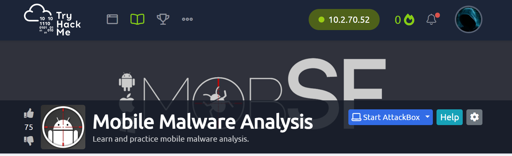
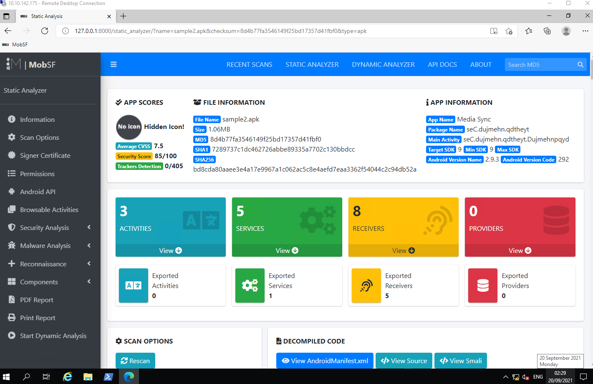
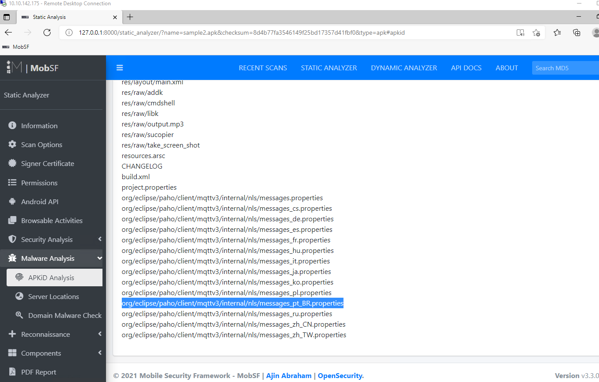

# TryHackMe Lab 4 MMA

     
# Task 1   

Completed

# Task 2  An Unknown Land

It is important to look at the past to understand why things are as they are today.
A new technology, due to the lack of exploration, appears to be extremely reliable. 
Every system is reliable, until someone proves otherwise.
You will need to do some research in order to answer the questions in this task.

What known as the first malware created to affect mobile devices?

Answer-`cabir`

What technology does this worm used to multiply?

Answer-`bluetooth`

What operating system did it infect?

Answer-`Symbian`

What message did it show on the screen of the infected mobile phone?

Answer-`caribe`

The worm was created and sent out by researchers as a PoC (Proof of Concept), they did not believe that the mobile operating system could be easily exploited. Since then, malicious programs have become more popular. 

# Task 3  Small size, a lot of destruction.

There is a weird file inside this machine, it looks malicious, but let's not jump into conclusions.

Deploy the machine in this task and wait for the connection to the machine to be made in your browser.

You can also connect to the TryHackMe VPN & use an RDP client of your choice using the following credentials:

Username: mma

Password: Malwareanalysis123!

RDP to machine IP 10.10.142.175

     
Deploy the machine & use MobSF to scan the file named "TWFsd2FyZQ.apk" that is located on the Desktop.

     
What is the format of the file?

Answer-`.apk`

The sample's size is 10,1 bytes, so it seems that it is not a complex application.

Completed

Decode the name of the sample.

Answer-`malware`

Which is the target platform?

Answer-`Android`

# Task 4  Digging Deeper

Let's make a deeper analysis.

VirusTotal is a incredible service, this web site can give us the power of analyze a package with the database of more then seventy Anti-Virus, and the result is fast and accurate.

https://www.virustotal.com/

To analyze the file in VirusTotal, you will need the file hash, you can get it by using the powershell cmdlet "Get-FileHash" or you can analyze the filw with MobSF and it will show the file hash (we will get back to this tool in the next task).

What does Avast-Mobile can tell us about this software?

     
Answer-`Android:Metasploit-G [PUP]`

What program was used to create the malware?

Answer-`metasploit`

The results provided by VirusTotal shows that we have a generic malware. It does not serve for attack purposes because we can see that a good part of the Antiviruses are detecting it, this malware is a good one for searching purposes, but it is also used for post exploitation.

What is the package name?

Answer-`com.metasploit.stage`

What is the SHA-1 signature?

Answer-`74d442594acf11dc6e3492ffea5eb8956afd000d`

By extracting the content, it will create a folder with some files inside, one of which is a XML. It describes some important information about the application for Android build tools, for Android operating system and for Google Play. This file declares items, shows some stuff as the package name and the permissions required to the device. The information that will be needed for the next questions can be found on VirusTotal also.

What is the unique XML file?

     
Answer-`AndroidManifest.xml`

How many permissions are there inside?

Answer-`22`

Which permission allows the application to take pictures with the camera?

Answer-`android.permission.CAMERA`

What is the message left by the community?

Answer-`THM{V1ru5-T0t4al-TWFsd2FyZS1BbmFseXNpcw}`

     
# Task 5  MobSFing the sample.

Let's use MobSF(Mobile Security Framework) to make a deeper analysis of this file, MobSF is a software created to make a security focused analysis of Android and IOS files. It can check for misconfigurations, leaked data and much more in a mobile program.

This tool can be used for static and dinamic analysis, in this room we will focus only in the static analysis but you are free to install it in a virtual machine you own to understand more how the application works, you can install it in GitHub - https://github.com/MobSF/Mobile-Security-Framework-MobSF.

The machine is configured to start MobSF when deployed, if you accidentally closed the web page you can visit the MobSF page by visiting the link http://127.0.0.1:8000 inside the deployed machine. Press the "Upload & Analyze" button and select the file we have been working on.

What is the programming language used to create the program?

Answer-`java`

How many signatures does the package has?

Answer-`1`

   
Application is signed with v1 signature scheme, what is it vulnerable to on Android <7.0?

Answer-`janus`

MobSF gives all the code decompiled. Just a base of programming make us able to understand a little bit of what is happening.

Completed

This malware is used to create a connection with the victim that is called a reverse shell.

Completed

What is the App name?

Answer-`.MainActivity`

It looks like  there is a function calling for the package manager, so it can see all the installed applications. What function is that?

Answer-`b.getPackageManager`

Returning to the manifest.

The flag "android:allowBackup" allows the user to backup application data via USB debugging. It is recommended that this be set as "False", even if by default it is "True".

What is the severity of this configuration

Answer-`medium`

     
# Task 6  It doesn't smell good!

I think that now we have the necessary knowledge to analyze bigger stuff.

Our next sample located on the Desktop, the name of the file is sample2.apk, let's start a MobSF analysis on it.

Answer the questions below

What is the SHA-256 hash of the file?

Answer-`bd8cda80aaee3e4a17e9967a1c062ac5c8e4aefd7eaa3362f54044c2c94db52a`

After finding the sample on VirusTotal, what does the "Avast" anti-virus engine recognizes it as?

Answer-`Android:Obfus-BM [Trj]`

With what we have, try to find out the name of the sample

Answer-`pegasus`

It seems like it is a very dangerous malware and has a big history of destruction.

This became news for spying journalists, what year was that?

Answer-`2017`

It was reported that the malware was developed by a legitimate intention:  The idea behind it was to use the software as a government tool designed to  track and combat terrorism and crime.

This malware has been found infecting people's smartphones and political activists in more than 44 countries.

Completed

If we search the name we found of the malware in MITRE ATT&CK (https://attack.mitre.org/), we can find some interesting information. 

What is the ID of the MITRE ATT&CK that is associated with our sample?

Answer-`S0316`

What technique has the ability to exploit OS vulnerabilities to escalate privileges?

Answer-`t1404`

  
Now, let's go back to the MobSF analysis.

Completed

There is a permission that when accepted, allows the application to access the list of accounts in the Accounts Service. What is the status shown by MobSF regarding this permission. (android.permission.GET.ACCOUNTS)

Answer-`dangerous	`

What org.eclipse.paho.client file refers to properties of Portuguese from Brazil (pt-br)?

Answer-`org/eclipse/paho/client/mqttv3/internal/nls/messages_pt_BR.properties`

This software has several features that make the identification and the processes it performs to explore the target, harder to handle, even when it is being analyzed.

Completed

The malware has a special appeal for its safety and its internal components, reducing the risk of compromise. It has a functionality for its cryptographic operations with the feature of a random bit generation service. How can it be identified?

Answer-`FCS_RBG_EXT.1.1`

