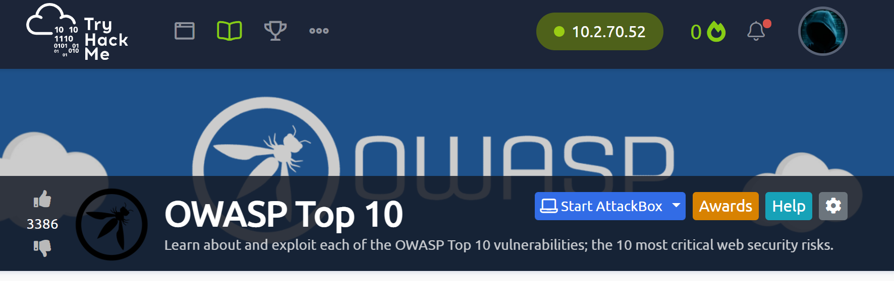
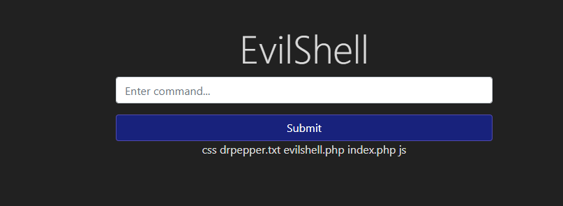
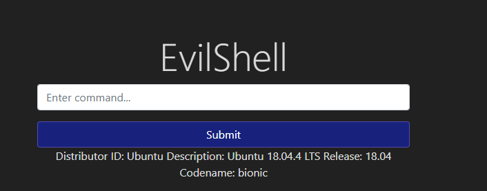
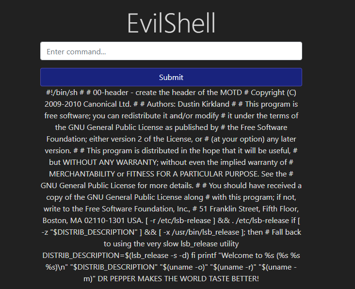
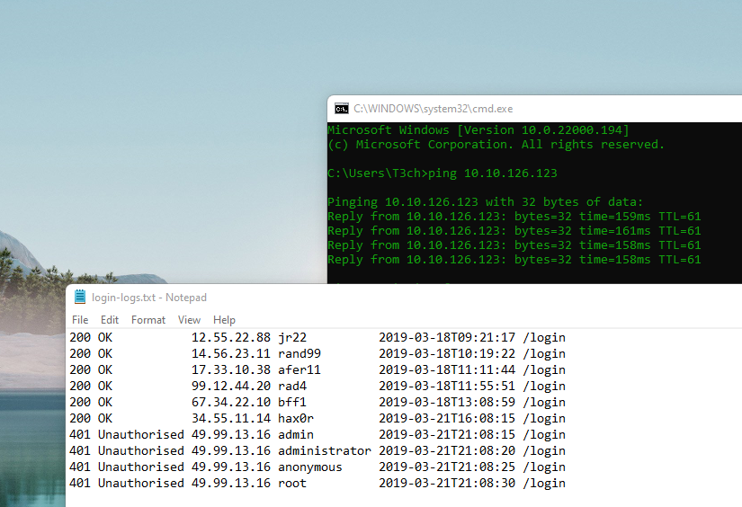

# TryHackMe Lab 5 OWASP Top 10

Task 1  Introduction

This room breaks each OWASP topic down and includes details on what the vulnerability is, how it occurs and how you can exploit it. You will put the theory into practise by completing supporting challenges.

Injection
Broken Authentication
Sensitive Data Exposure
XML External Entity
Broken Access Control
Security Misconfiguration
Cross-site Scripting
Insecure Deserialization
Components with Known Vulnerabilities
Insufficent Logging & Monitoring
The room has been designed for beginners and assume no previous knowledge of security.

Completed

Task 1  Introduction

Completed (connected to vpn)

Task 3  [Severity 1] Injection

Injection flaws are very common in applications today. These flaws occur because user controlled input is interpreted as actual commands or parameters by the application. Injection attacks depend on what technologies are being used and how exactly the input is interpreted by these technologies. Some common examples include:
SQL Injection: This occurs when user controlled input is passed to SQL queries. As a result, an attacker can pass in SQL queries to manipulate the outcome of such queries. 
Command Injection: This occurs when user input is passed to system commands. As a result, an attacker is able to execute arbitrary system commands on application servers.

If an attacker is able to successfully pass input that is interpreted correctly, they would be able to do the following:
Access, Modify and Delete information in a database when this input is passed into database queries. This would mean that an attacker can steal sensitive information such as personal details and credentials.
Execute Arbitrary system commands on a server that would allow an attacker to gain access to users’ systems. This would enable them to steal sensitive data and carry out more attacks against infrastructure linked to the server on which the command is executed.

The main defence for preventing injection attacks is ensuring that user controlled input is not interpreted as queries or commands. There are different ways of doing this:
Using an allow list: when input is sent to the server, this input is compared to a list of safe input or characters. If the input is marked as safe, then it is processed. Otherwise, it is rejected and the application throws an error.
Stripping input: If the input contains dangerous characters, these characters are removed before they are processed.

Dangerous characters or input is classified as any input that can change how the underlying data is processed. Instead of manually constructing allow lists or even just stripping input, there are various libraries that perform these actions for you.

Completed

Task 4  [Severity 1] OS Command Injection

Completed

Task 5  [Severity 1] Command Injection Practical

Accessed `http://10.10.126.123/evilshell.php`

Ran `ls` command

     
What strange text file is in the website root directory?

Answer-`drpepper.txt `

How many non-root/non-service/non-daemon users are there?

ran command `cat etc/passwd`

Answer-`0`

What user is this app running as?

ran command `whoami`

Answer-`www-data`

What is the user's shell set as?

Ran cat /etc/passwd

Answer-`/usr/sbin/nologin`

What version of Ubuntu is running?

Answer-`18.04.4`

Print out the MOTD.  What favorite beverage is shown?

Ran command `cat /etc/update-motd.d/00-header`

     
Answer-`Dr Pepper`

Task 6  [Severity 2] Broken Authentication

Authentication and session management constitute core components of modern web applications. Authentication allows users to gain access to web applications by verifying their identities. The most common form of authentication is using a username and password mechanism. A user would enter these credentials, the server would verify them. If they are correct, the server would then provide the users’ browser with a session cookie. A session cookie is needed because web servers use HTTP(S) to communicate which is stateless. Attaching session cookies means that the server will know who is sending what data. The server can then keep track of users' actions. 

If an attacker is able to find flaws in an authentication mechanism, they would then successfully gain access to other users’ accounts. This would allow the attacker to access sensitive data (depending on the purpose of the application). Some common flaws in authentication mechanisms include:

Brute force attacks: If a web application uses usernames and passwords, an attacker is able to launch brute force attacks that allow them to guess the username and passwords using multiple authentication attempts. 
Use of weak credentials: web applications should set strong password policies. If applications allow users to set passwords such as ‘password1’ or common passwords, then an attacker is able to easily guess them and access user accounts. They can do this without brute forcing and without multiple attempts.
Weak Session Cookies: Session cookies are how the server keeps track of users. If session cookies contain predictable values, an attacker can set their own session cookies and access users’ accounts. 
There can be various mitigation for broken authentication mechanisms depending on the exact flaw:

To avoid password guessing attacks, ensure the application enforces a strong password policy. 
To avoid brute force attacks, ensure that the application enforces an automatic lockout after a certain number of attempts. This would prevent an attacker from launching more brute force attacks.
Implement Multi Factor Authentication - If a user has multiple methods of authentication, for example, using username and passwords and receiving a code on their mobile device, then it would be difficult for an attacker to get access to both credentials to get access to their account.

Completed

Task 7  [Severity 2] Broken Authentication Practical

For this example, we'll be looking at a logic flaw within the authentication mechanism.

A lot of times what happens is that developers forgets to sanitize the input(username & password) given by the user in the code of their application, which can make them vulnerable to attacks like SQL injection. However, we are going to focus on a vulnerability that happens because of a developer's mistake but is very easy to exploit i.e re-registration of an existing user.

Let's understand this with the help of an example, say there is an existing user with the name admin and now we want to get access to their account so what we can do is try to re-register that username but with slight modification. We are going to enter " admin"(notice the space in the starting). Now when you enter that in the username field and enter other required information like email id or password and submit that data. It will actually register a new user but that user will have the same right as normal admin. That new user will also be able to see all the content presented under the user admin.

To see this in action go to http://10.10.126.123:8888 and try to register a user name darren, you'll see that user already exists so then try to register a user " darren" and you'll see that you are now logged in and will be able to see the content present only in Darren's account which in our case is the flag that you need to retrieve.

Went to `http://10.10.126.123:8888/`

Answer`fe86079416a21a3c99937fea8874b667`

What is the flag that you found in arthur's account?

Answer-`d9ac0f7db4fda460ac3edeb75d75e16e`

Task 8  [Severity 3] Sensitive Data Exposure (Introduction)

When a webapp accidentally divulges sensitive data, we refer to it as "Sensitive Data Exposure". This is often data directly linked to customers (e.g. names, dates-of-birth, financial information, etc), but could also be more technical information, such as usernames and passwords. At more complex levels this often involves techniques such as a "Man in The Middle Attack", whereby the attacker would force user connections through a device which they control, then take advantage of weak encryption on any transmitted data to gain access to the intercepted information (if the data is even encrypted in the first place...). Of course, many examples are much simpler, and vulnerabilities can be found in web apps which can be exploited without any advanced networking knowledge. Indeed, in some cases, the sensitive data can be found directly on the webserver itself...

The web application in this box contains one such vulnerability. Deploy the machine, then read through the supporting material in the following tasks as the box boots up.

Completed

Task 9  [Severity 3] Sensitive Data Exposure (Supporting Material 1)

The most common way to store a large amount of data in a format that is easily accessible from many locations at once is in a database. This is obviously perfect for something like a web application, as there may be many users interacting with the website at any one time. Database engines usually follow the Structured Query Language (SQL) syntax; however, alternative formats (such as NoSQL) are rising in popularity.

In a production environment it is common to see databases set up on dedicated servers, running a database service such as MySQL or MariaDB; however, databases can also be stored as files. These databases are referred to as "flat-file" databases, as they are stored as a single file on the computer. This is much easier than setting up a full database server, and so could potentially be seen in smaller web applications. Accessing a database server is outwith the scope of today's task, so let's focus instead on flat-file databases.

As mentioned previously, flat-file databases are stored as a file on the disk of a computer. Usually this would not be a problem for a webapp, but what happens if the database is stored underneath the root directory of the website (i.e. one of the files that a user connecting to the website is able to access)? Well, we can download it and query it on our own machine, with full access to everything in the database. Sensitive Data Exposure indeed!

That is a big hint for the challenge, so let's briefly cover some of the syntax we would use to query a flat-file database.

The most common (and simplest) format of flat-file database is an sqlite database. These can be interacted with in most programming languages, and have a dedicated client for querying them on the command line. This client is called "sqlite3", and is installed by default on Kali.

Completed

Task 10  [Severity 3] Sensitive Data Exposure (Supporting Material 2)

In the previous task we saw how to query an SQLite database for sensitive data. We found a collection of password hashes, one for each user. In this task we will briefly cover how to crack these.

When it comes to hash cracking, Kali comes pre-installed with various tools -- if you know how to use these then feel free to do so; however, they are outwith the scope of this material.

Instead we will be using the online tool: Crackstation. This website is extremely good at cracking weak password hashes. For more complicated hashes we would need more sophisticated tools; however, all of the crackable password hashes used in today's challenge are weak MD5 hashes, which Crackstation should handle very nicely indeed.

When we navigate to the website we are met with the following interface:

Completed

Task 11  [Severity 3] Sensitive Data Exposure (Challenge)

Have a look around the webapp. The developer has left themselves a note indicating that there is sensitive data in a specific directory. 

What is the name of the mentioned directory?

Answer`/assets`

Navigate to the directory you found in question one. What file stands out as being likely to contain sensitive data?

Answer-`webapp.db`

Use the supporting material to access the sensitive data. What is the password hash of the admin user?

Answer-`6eea9b7ef19179a06954edd0f6c05ceb`

Crack the hash.
What is the admin's plaintext password?

Answer-`qwertyuiop`

Login as the admin. What is the flag?

Answer-`THM{Yzc2YjdkMjE5N2VjMzNhOTE3NjdiMjdl}`

Task 12  [Severity 4] XML External Entity

An XML External Entity (XXE) attack is a vulnerability that abuses features of XML parsers/data. It often allows an attacker to interact with any backend or external systems that the application itself can access and can allow the attacker to read the file on that system. They can also cause Denial of Service (DoS) attack or could use XXE to perform Server-Side Request Forgery (SSRF) inducing the web application to make requests to other applications. XXE may even enable port scanning and lead to remote code execution.

There are two types of XXE attacks: in-band and out-of-band (OOB-XXE).
1) An in-band XXE attack is the one in which the attacker can receive an immediate response to the XXE payload.

2) out-of-band XXE attacks (also called blind XXE), there is no immediate response from the web application and attacker has to reflect the output of their XXE payload to some other file or their own server.

This challenge is from our subscriber only material - happy hacking!

Completed

Task 13  [Severity 4 XML External Entity - eXtensible Markup Language

Before we move on to learn about XXE exploitation we'll have to understand XML properly.

What is XML?

XML (eXtensible Markup Language) is a markup language that defines a set of rules for encoding documents in a format that is both human-readable and machine-readable. It is a markup language used for storing and transporting data. 

Why we use XML?

1. XML is platform-independent and programming language independent, thus it can be used on any system and supports the technology change when that happens.

2. The data stored and transported using XML can be changed at any point in time without affecting the data presentation.

3. XML allows validation using DTD and Schema. This validation ensures that the XML document is free from any syntax error.

4. XML simplifies data sharing between various systems because of its platform-independent nature. XML data doesn’t require any conversion when transferred between different systems.

Syntax

Every XML document mostly starts with what is known as XML Prolog.

Full form of XML

Answer-`eXtensible Markup Language`

Is it compulsory to have XML prolog in XML documents?

Answer-`no`

Can we validate XML documents against a schema?

Answer-`yes`

Task 14  [Severity 4] XML External Entity - DTD

Before we move on to start learning about XXE we'll have to understand what is DTD in XML.

DTD stands for Document Type Definition. A DTD defines the structure and the legal elements and attributes of an XML document.

Let us try to understand this with the help of an example. Say we have a file named note.dtd with the following conten

How do you define a new ELEMENT?

Answer-` !ELEMENT`

How do you define a ROOT element?

Answer-`!DOCTYPE`

How do you define a new ENTITY?

Answer-`!ENTITY`

Task 15  [Severity 4] XML External Entity - XXE Payload

Now we'll see some XXE payload and see how they are working.

1) The first payload we'll see is very simple. If you've read the previous task properly then you'll understand this payload very easily.

Completed

Task 16  [Severity 4] XML External Entity - Exploiting

Now let us see some payloads in action. The payload that I'll be using is the one we saw in the previous task.

Try to display your own name using any payload.

Completed

See if you can read the /etc/passwd

Completed

What is the name of the user in /etc/passwd

Answer-`falcon`

Where is falcon's SSH key located?

Answer-`/home/falcon/.ssh/id_rsa`

What are the first 18 characters for falcon's private key

Task 17  [Severity 5] Broken Access Control

Websites have pages that are protected from regular visitors, for example only the site's admin user should be able to access a page to manage other users. If a website visitor is able to access the protected page/pages that they are not authorised to view, the access controls are broken.

A regular visitor being able to access protected pages, can lead to the following:
Being able to view sensitive information
Accessing unauthorized functionality
OWASP have a listed a few attack scenarios demonstrating access control weaknesses:

Completed

 [Severity 5] Broken Access Control (IDOR Challenge)
 
 IDOR, or Insecure Direct Object Reference, is the act of exploiting a misconfiguration in the way user input is handled, to access resources you wouldn't ordinarily be able to access. IDOR is a type of access control vulnerability.

For example, let's say we're logging into our bank account, and after correctly authenticating ourselves, we get taken to a URL like this https://example.com/bank?account_number=1234. On that page we can see all our important bank details, and a user would do whatever they needed to do and move along their way thinking nothing is wrong.

There is however a potentially huge problem here, a hacker may be able to change the account_number parameter to something else like 1235, and if the site is incorrectly configured, then he would have access to someone else's bank information.

Completed

visit `http://10.10.126.123`

Completed

Look at other users notes. What is the flag?

Answer-`flag{fivefourthree}`

Task 19  [Severity 6] Security Misconfiguration

Security Misconfigurations are distinct from the other Top 10 vulnerabilities, because they occur when security could have been configured properly but was not.

Security misconfigurations include:

Poorly configured permissions on cloud services, like S3 buckets
Having unnecessary features enabled, like services, pages, accounts or privileges
Default accounts with unchanged passwords
Error messages that are overly detailed and allow an attacker to find out more about the system
Not using HTTP security headers, or revealing too much detail in the Server: HTTP header
This vulnerability can often lead to more vulnerabilities, such as default credentials giving you access to sensitive data, XXE or command injection on admin pages.

For more info, I recommend having a look at the OWASP top 10 entry for Security Misconfiguration

Completed

Hack into the webapp, and find the flag!

Answer-`thm{4b9513968fd564a87b28aa1f9d672e17}`

Task 20  [Severity 7] Cross-site Scripting

Cross-site scripting, also known as XSS is a security vulnerability typically found in web applications. It’s a type of injection which can allow an attacker to execute malicious scripts and have it execute on a victim’s machine.

A web application is vulnerable to XSS if it uses unsanitized user input. XSS is possible in Javascript, VBScript, Flash and CSS. There are three main types of cross-site scripting:
Stored XSS - the most dangerous type of XSS. This is where a malicious string originates from the website’s database. This often happens when a website allows user input that is not sanitised (remove the "bad parts" of a users input) when inserted into the database.
Reflected XSS - the malicious payload is part of the victims request to the website. The website includes this payload in response back to the user. To summarise, an attacker needs to trick a victim into clicking a URL to execute their malicious payload.
DOM-Based XSS - DOM stands for Document Object Model and is a programming interface for HTML and XML documents. It represents the page so that programs can change the document structure, style and content. A web page is a document and this document can be either displayed in the browser window or as the HTML source.
For more XSS explanations and exercises, check out the XSS room.

Completed

Navigate to http://10.10.126.123/ in your browser and click on the "Reflected XSS" tab on the navbar; craft a reflected XSS payload that will cause a popup saying "Hello".

Created payload``

Answer-`ThereIsMoreToXSSThanYouThink`

On the same reflective page, craft a reflected XSS payload that will cause a popup with your machines IP address.

created reflected payload``

Answer-`ReflectiveXss4TheWin`

Now navigate to http://10.10.126.123/ in your browser and click on the "Stored XSS" tab on the navbar; make an account.

Then add a comment and see if you can insert some of your own HTML.

Answer-`HTML_T4gs`

On the same page, create an alert popup box appear on the page with your document cookies.

created new payload ``

Answer-`W3LL_D0N3_LVL2`

Change "XSS Playground" to "I am a hacker" by adding a comment and using Javascript.

Created payload ``

Answer-`websites_can_be_easily_defaced_with_xss`

Task 21  [Severity 8] Insecure Deserialization

"Insecure Deserialization is a vulnerability which occurs when untrusted data is used to abuse the logic of an application" (Acunetix., 2017)

This definition is still quite broad to say the least. Simply, insecure deserialization is replacing data processed by an application with malicious code; allowing anything from DoS (Denial of Service) to RCE (Remote Code Execution) that the attacker can use to gain a foothold in a pentesting scenario.

Specifically, this malicious code leverages the legitimate serialization and deserialization process used by web applications. We'll be explaining this process and why it is so commonplace in modern web applications.

OWASP rank this vulnerability as 8 out of 10 because of the following reasons:

- Low exploitability. This vulnerability is often a case-by-case basis - there is no reliable tool/framework for it. Because of its nature, attackers need to have a good understanding of the inner-workings of the ToE.

- The exploit is only as dangerous as the attacker's skill permits, more so, the value of the data that is exposed. For example, someone who can only cause a DoS will make the application unavailable. The business impact of this will vary on the infrastructure - some organisations will recover just fine, others, however, will not.

Who developed the Tomcat application?

Answer-`Apache Software Foundation`

What type of attack that crashes services can be performed with insecure deserialization?

Answer-`Denial of Service`

Task 22  [Severity 8] Insecure Deserialization - Objects

A prominent element of object-oriented programming (OOP), objects are made up of two things:
- State
- Behaviour

Simply, objects allow you to create similar lines of code without having to do the leg-work of writing the same lines of code again.

For example, a lamp would be a good object. Lamps can have different types of bulbs, this would be their state, as well as being either on/off - their behaviour!

Rather than having to accommodate every type of bulb and whether or not that specific

Select the correct term of the following statement:

if a dog was sleeping, would this be:

A) A State
B) A Behaviour 

Answer-`A behaviour`

Task 23  [Severity 8] Insecure Deserialization - Deserialization

De(Serialization)

Learning is best done through analogies

A Tourist approaches you in the street asking for directions. They're looking for a local landmark and got lost. Unfortunately, English isn't their strong point and nor do you speak their dialect either. What do you do? You draw a map of the route to the landmark because pictures cross language barriers, they were able to find the landmark. Nice! You've just serialised some information, where the tourist then deserialised it to find the landmark.

Continued

Serialisation is the process of converting objects used in programming into simpler, compatible formatting for transmitting between systems or networks for further processing or storage.

Alternatively, deserialisation is the reverse of this; converting serialised information into their complex form - an object that the application will understand.

What does this mean?

Say you have a password of "password123" from a program that needs to be stored in a database on another system. To travel across a network this string/output needs to be converted to binary. Of course, the password needs to be stored as "password123" and not its binary notation. Once this reaches the database, it is converted or deserialised back into "password123" so it can be stored.

The process is best explained through diagrams:

How can we leverage this?

Simply, insecure deserialization occurs when data from an untrusted party (I.e. a hacker) gets executed because there is no filtering or input validation; the system assumes that the data is trustworthy and will execute it no holds barred.

What is the name of the base-2 formatting that data is sent across a network as?

Answer-`binary`

Task 24  [Severity 8] Insecure Deserialization - Cookies

Ah yes, the origin of many memes. Cookies are an essential tool for modern websites to function. Tiny pieces of data, these are created by a website and stored on the user's computer. 

You'll see notifications like the above on most websites these days. Websites use these cookies to store user-specific behaviours like items in their shopping cart or session IDs.

In the web application, we're going to exploit, you'll notice cookies store login information like the below! Yikes!

If a cookie had the path of webapp.com/login , what would the URL that the user has to visit be?

Answer-`webapp.com/login`

What is the acronym for the web technology that Secure cookies work over?

Answer-`https`

Task 25  [Severity 8] Insecure Deserialization - Cookies Practical

1st flag (cookie value)

Answer-`THM{good_old_base64_huh}`

2nd flag (admin dashboard)

Answer-`THM{heres_the_admin_flag}`

Task 26  [Severity 8] Insecure Deserialization - Code Execution

A much more nefarious attack then simply decoding cookies, we get into the nitty-gritty.

Setup

1. First, change the value of the userType cookie from "admin" to "user" and return to http://10.10.126.123/myprofile 

2. Then, left-click on the URL in "Exhange your vim" found in the screenshot below.

ran command cat flag.txt

Answer-`4a69a7ff9fd68`

Task 27  [Severity 9] Components With Known Vulnerabilities - Intro

Occasionally, you may find that the company/entity that you're pen-testing is using a program that already has a well documented vulnerability.

For example, let's say that a company hasn't updated their version of WordPress for a few years, and using a tool such as wpscan, you find that it's version 4.6. Some quick research will reveal that WordPress 4.6 is vulnerable to an unauthenticated remote code execution(RCE) exploit, and even better you can find an exploit already made on exploit-db.

As you can see this would be quite devastating, because it requires very little work on the part of the attacker as often times since the vulnerability is already well known, someone else has made an exploit for the vulnerability. The situation becomes even worse when you realize, that it's really quite easy for this to happen, if a company misses a single update for a program they use, they could be vulnerable to any number of attacks.

Hence, why OWASP has rated this a 3(meaning high) on the prevalence scale, it is incredibly easy for a company to miss an update for an application.

Completed

Task 28  [Severity 9] Components With Known Vulnerabilities - Exploit

Recall that since this is about known vulnerabilities, most of the work has already been done for us. Our main job is to find out the information of the software, and research it until we can find an exploit. Let's go through that with an example web application.

Completed

Task 29  [Severity 9] Components With Known Vulnerabilities - Lab

The following is a vulnerable application, all information you need to exploit it can be found online. 

Note: When you find the exploit script, put all of your input in quotes, for example "id"

How many characters are in /etc/passwd (use wc -c /etc/passwd to get the answer)

ran command `wc -c /etc/passwd`

Answer-`1611`

Task 30  [Severity 10] Insufficient Logging and Monitoring

Downloaded file

When web applications are set up, every action performed by the user should be logged. Logging is important because in the event of an incident, the attackers actions can be traced. Once their actions are traced, their risk and impact can be determined. Without logging, there would be no way to tell what actions an attacker performed if they gain access to particular web applications. The bigger impacts of these include:

regulatory damage: if an attacker has gained access to personally identifiable user information and there is no record of this, not only are users of the application affected, but the application owners may be subject to fines or more severe actions depending on regulations.
risk of further attacks: without logging, the presence of an attacker may be undetected. This could allow an attacker to launch further attacks against web application owners by stealing credentials, attacking infrastructure and more.
The information stored in logs should include:

HTTP status codes
Time Stamps
Usernames
API endpoints/page locations
IP addresses
These logs do have some sensitive information on them so its important to ensure that logs are stored securely and multiple copies of these logs are stored at different locations.

As you may have noticed, logging is more important after a breach or incident has occurred. The ideal case is having monitoring in place to detect any suspicious activity. The aim of detecting this suspicious activity is to either stop the attacker completely or reduce the impact they've made if their presence has been detected much later than anticipated. Common examples of suspicious activity includes:

multiple unauthorised attempts for a particular action (usually authentication attempts or access to unauthorised resources e.g. admin pages)
requests from anomalous IP addresses or locations: while this can indicate that someone else is trying to access a particular user's account, it can also have a false positive rate.
use of automated tools: particular automated tooling can be easily identifiable e.g. using the value of User-Agent headers or the speed of requests. This can indicate an attacker is using automated tooling.
common payloads: in web applications, it's common for attackers to use Cross Site Scripting (XSS) payloads. Detecting the use of these payloads can indicate the presence of someone conducting unauthorised/malicious testing on applications.
Just detecting suspicious activity isn't helpful. This suspicious activity needs to be rated according to the impact level. For example, certain actions will higher impact than others. These higher impact actions need to be responded to sooner thus they should raise an alarm which raises the attention of the relevant party.

Put this knowledge to practise by analysing this sample log file.

What IP address is the attacker using?

opened login-logs.txt and found unauthorized connections.

Answer-`49.99.13.16`

What kind of attack is being carried out?
   
Answer-`brute force`

What Next?
Why not enroll in our beginner level pathway or find another room to complete?

Completed
