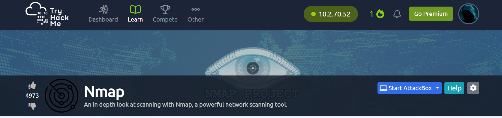

# TryHackMe Lab 3 Nmap

     
# Task 1  Intro Deploy The Machine
Connected VPN   

# Task 2  Introduction

What networking constructs are used to direct traffic to the right application on a server?

Answer-`ports`

How many of these are available on any network-enabled computer?

Answer-`65535`

[Research] How many of these are considered "well-known"? (These are the "standard" numbers mentioned in the task)

Answer-`1024`

# Task 3  Nmap Switches

Like most pentesting tools, nmap is run from the terminal. There are versions available for both Windows and Linux. For this room we will assume that you are using Linux; however, the switches should be identical. Nmap is installed by default in both Kali Linux and the TryHackMe Attack Box.

Nmap can be accessed by typing nmap into the terminal command line, followed by some of the "switches" (command arguments which tell a program to do different things) we will be covering below.

All you'll need for this is the help menu for nmap (accessed with nmap -h) and/or the nmap man page (access with man nmap). For each answer, include all parts of the switch unless otherwise specified. This includes the hyphen at the start (-).

Ran command `nmap -h`

What is the first switch listed in the help menu for a 'Syn Scan' (more on this later!)?

Answer-`-Ss`

Which switch would you use for a "UDP scan"?

Answer-`-su`

If you wanted to detect which operating system the target is running on, which switch would you use?

Answer-`-o`

Nmap provides a switch to detect the version of the services running on the target. What is this switch?

Answer-`-sv`

The default output provided by nmap often does not provide enough information for a pentester. How would you increase the verbosity?

Answer-`-v`

Verbosity level one is good, but verbosity level two is better! How would you set the verbosity level to two?
(Note: it's highly advisable to always use at least this option)

Answer-`-vv`

We should always save the output of our scans -- this means that we only need to run the scan once (reducing network traffic and thus chance of detection), and gives us a reference to use when writing reports for clients.

What switch would you use to save the nmap results in three major formats?

Answer-`-oA`

What switch would you use to save the nmap results in a "normal" format?

Answer-`-oN`

A very useful output format: how would you save results in a "grepable" format?

Sometimes the results we're getting just aren't enough. If we don't care about how loud we are, we can enable "aggressive" mode. This is a shorthand switch that activates service detection, operating system detection, a traceroute and common script scanning.

How would you activate this setting?

Answer-`-oG`

Sometimes the results we're getting just aren't enough. If we don't care about how loud we are, we can enable "aggressive" mode. This is a shorthand switch that activates service detection, operating system detection, a traceroute and common script scanning.

How would you activate this setting?

Answer-`-A`

Nmap offers five levels of "timing" template. These are essentially used to increase the speed your scan runs at. Be careful though: higher speeds are noisier, and can incur errors!

How would you set the timing template to level 5?

Answer-`-T5`

e can also choose which port(s) to scan.

How would you tell nmap to only scan port 80?

Answer-`-p 80`

How would you tell nmap to scan ports 1000-1500?

Answer-`-p 1000-15000`

A very useful option that should not be ignored:

How would you tell nmap to scan all ports?

Answer-`-p-`

How would you activate a script from the nmap scripting library (lots more on this later!)?

Answer-`-script=vuln`

# Task 4  Scan Types Overview

When port scanning with Nmap, there are three basic scan types. These are

TCP Connect Scans (-sT)
SYN "Half-open" Scans (-sS)
UDP Scans (-sU)
Additionally there are several less common port scan types, some of which we will also cover (albeit in less detail). These are:

TCP Null Scans (-sN)
TCP FIN Scans (-sF)
TCP Xmas Scans (-sX)
Most of these (with the exception of UDP scans) are used for very similar purposes, however, the way that they work differs between each scan. This means that, whilst one of the first three scans are likely to be your go-to in most situations, it's worth bearing in mind that other scan types exist.

In terms of network scanning, we will also look briefly at ICMP (or "ping") scanning.

# Task 5  Scan Types TCP Connect Scans

To understand TCP Connect scans (-sT), it's important that you're comfortable with the TCP three-way handshake. If this term is new to you then completing Introductory Networking before continuing would be advisable.
 
Which RFC defines the appropriate behaviour for the TCP protocol?
  
Answer-`RFC 793`
 
If a port is closed, which flag should the server send back to indicate this?

Answer-`RST`

# Task 6  Scan Types SYN Scans

As with TCP scans, SYN scans (-sS) are used to scan the TCP port-range of a target or targets; however, the two scan types work slightly differently. SYN scans are sometimes referred to as "Half-open" scans, or "Stealth" scans.

There are two other names for a SYN scan, what are they?

Answer-`half-open, stealth`

Can Nmap use a SYN scan without Sudo permissions (Y/N)?

Answer-`n`

# Task 7  Scan Types UDP Scans

  
  
